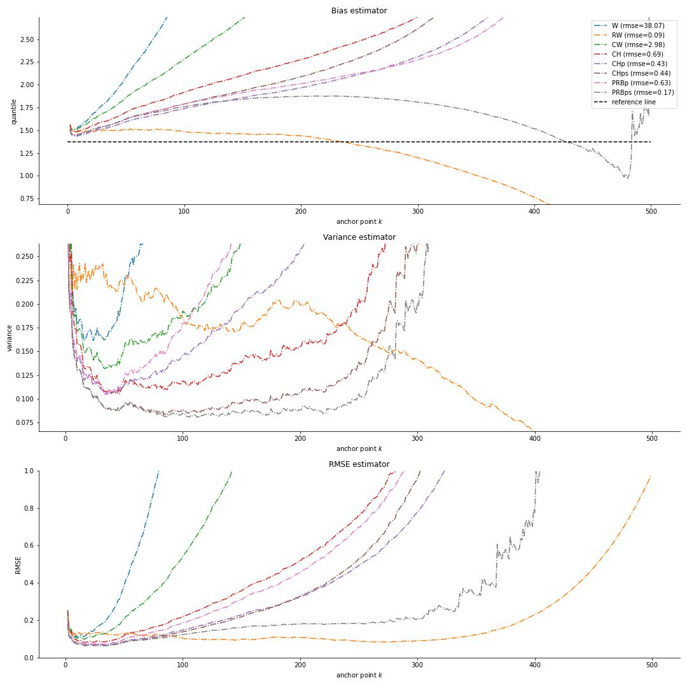
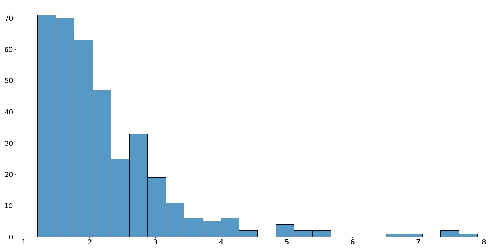
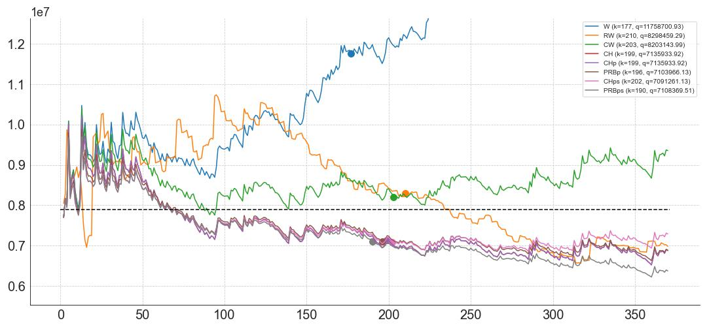

# A refined Weissman estimator of extreme quantile, 2022
Implementation of the paper ["A refined Weissman estimator of extreme quantile"](https://hal.inria.fr/hal-03266676v2/document),
by [Jonathan El Methni](https://scholar.google.fr/citations?user=JjjH8N8AAAAJ&hl=fr), [Stéphane Girard](http://mistis.inrialpes.fr/people/girard/).

The repo contains the codes for comparing our proposed extreme quantile estimator with 7 other known estimators in the literature 
on both simulated and real-data.

## Abstract
Weissman extrapolation methodology for estimating extreme quantiles from heavy-tailed distribution is based on two estimators: an order statistic to estimate an intermediate quantile and an estimator of the tail-index. 
The common practice is to select the same intermediate sequence for both estimators.
In this work, we show how an adapted choice of two different  intermediate sequences leads to a reduction of the asymptotic bias associated with the resulting refined Weissman estimator. 
The asymptotic normality of the latter estimator is established and a data-driven method is introduced for the practical selection of the intermediate sequences.
Our approach is compared to other bias reduced estimators of extreme quantiles both on simulated and real data.


## Dependencies
Clone the repo

```
git clone https://github.com/michael-allouche/refined-weissman.git
cd refined-weissman
```


Install the requirements for each software version used in this repo
- Python 3.10.1

_via pip_

`pip install -r requirements.txt`

_or via conda_

```
conda create --name rweissman python=3.10
conda activate rweissman
conda install --file requirements.txt
```

- R 4.1.2

`install.packages("evt0")`

## Usage

### Simulated data
Seven heavy-tailed distributions are implemented in `./extreme/distribution.py`:

**Burr, NHW, Fréchet, Fisher, GPD, Inverse Gamma, Student**.

In `run_evt_estimators.py`, one can update the `dict_runner` with the desired parametrization. 
Next, run `run_evt_estimators.py` to compute all the quantile estimators at both quantile levels alpha=1/n and alpha=1/(2n) . 
For example, estimations applied to 1000 replications of 500 samples issued from a Burr distribution:

`python run_evt_estimators.py -d burr -r 1000 -n 500`

Once the run is finished, all the metrics for each estimator are saved in the folder `./ckpt`.

In the notebook, you can display a table result. For example

```
from extreme.estimators import evt_estimators 
evt_estimators(n_replications=1000, params={"evi":0.125, "rho": -1.},
                distribution="burr", 
               n_data=500, n_quantile="2n")
```
```
Estimators     W	RW	CW	CH	CHp	PRBp	CHps	PRBps

RMSE	      0.0471	0.0095	0.0063	0.0155	0.0149	0.015	0.0135	0.0164
```
You can also plot the bias, the variance and the RMSE

```
from extreme import visualization as statsviz
statsviz.evt_quantile_plot(n_replications=1000, 
   		           params={"evi":0.125, "rho": -0.125}, 
                           distribution="burr", 
                           n_data=500, 
                           n_quantile="2n")
```



### Real data
We consider here the Secura Belgian reinsurance data set in `./dataset/besecura.txt` on automobile claims from 1998 until 2001.
This data set consists of  claims which were at least as large as 1.2 million Euros and were corrected for inflation. 
Our goal is to estimate the extreme quantile 
(with ) and to compare it to the maximum 
of the sample million Euros.



Display the quantile plot and the selected intemediate sequence 
using our proposed Algorithm in the paper.
`statsviz.real_quantile_plot(saved=True)`



## Citing
@unpublished{girard2021refined,\
	TITLE = {{A refined Weissman estimator for extreme quantiles}},\
	AUTHOR = {El Methni, J. and Girard, S.},\
	URL = {{\tt https://hal.inria.fr/hal-03266676}}, \
	YEAR = {2021}
}